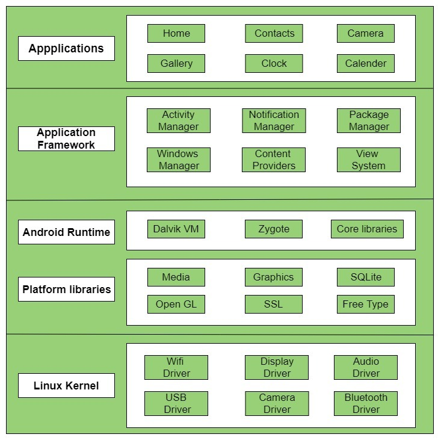

## 1. Difference between abstract class concrete class and interface class with example java?


In Java, abstract classes, concrete classes, and interfaces are different constructs used for defining classes and their behavior. Here's an explanation of each along with an example:

#### Abstract Class:

<!-- An abstract class is a class that cannot be instantiated on its own and serves as a blueprint for other classes.
It can contain both abstract and non-abstract methods.
Abstract methods are declared without an implementation and must be implemented by any non-abstract subclass.
It can also have regular methods with implementations.
Abstract classes are useful when you want to provide a common interface for a group of related classes. -->
An abstract class is a class that cannot be instantiated on its own and serves as a blueprint for other classes. It can contain both abstract and non-abstract methods. Abstract methods are declared without an implementation and must be implemented by any non-abstract subclass. It can also have regular methods with implementations. Abstract classes are useful when you want to provide a common interface for a group of related classes.

#### Example:

```
abstract class Animal {
    public abstract void makeSound();
    
    public void sleep() {
        System.out.println("Zzz");
    }
}

class Dog extends Animal {
    public void makeSound() {
        System.out.println("Woof");
    }
}

public class Main {
    public static void main(String[] args) {
        Animal animal = new Dog();
        animal.makeSound();
        animal.sleep();
    }
}
```
#### Output:
```
Woof
Zzz
```

#### Concrete Class:

A concrete class is a regular class that can be instantiated directly. It can have both abstract and non-abstract methods, but all the abstract methods defined in its parent abstract class must be implemented. Concrete classes provide the actual implementation of the methods defined in their parent classes. They are used to create objects that have specific behavior and attributes.

#### Example:


```
abstract class Vehicle {
    public abstract void start();
}

class Car extends Vehicle {
    public void start() {
        System.out.println("Car started");
    }
}

public class Main {
    public static void main(String[] args) {
        Vehicle vehicle = new Car();
        vehicle.start();
    }
}

```
#### Output:
```
Car started

```

#### Interface

An interface is a collection of abstract methods that defines a contract for classes to adhere to. It cannot be instantiated directly; instead, classes implement interfaces to provide their own implementation of the interface methods. An interface can contain constant fields (public static final) and default methods (with implementations) since Java 8. It is useful when you want to enforce certain behavior across unrelated classes.

#### Example:


```
interface Shape {
    void draw();
}

class Circle implements Shape {
    public void draw() {
        System.out.println("Drawing a circle");
    }
}

public class Main {
    public static void main(String[] args) {
        Shape shape = new Circle();
        shape.draw();
    }
}


```
#### Output:
```
Drawing a circle
```
In summary, abstract classes provide a common interface and may have implemented methods, concrete classes are regular classes that provide the actual implementation, and interfaces define contracts for classes to implement.

## 2. Differentiate between class and object ? write a class , instantiate it and explain

**Class:**
A class is a blueprint or template that defines the structure and behavior of objects. It specifies the attributes (variables) and methods (functions) that objects of that class will have. It acts as a blueprint for creating multiple instances (objects) with similar characteristics.A class can be considered as a user-defined data type.

**Object:**
An object is an instance of a class. It represents a specific occurrence of the class, with its own set of attribute values and can perform actions defined by the class's methods. Objects are created using the new keyword, which allocates memory for the object and calls the class's constructor to initialize it. Each object has its own unique state and behavior, while still adhering to the structure and behavior defined by the class.
```
// Class definition
public class Car {
    private String make;
    private String model;
    private int year;

    public Car(String make, String model, int year) {
        this.make = make;
        this.model = model;
        this.year = year;
    }

    public void startEngine() {
        System.out.println("The engine is now running.");
    }

    public void stopEngine() {
        System.out.println("The engine has been stopped.");
    }
}

// Object instantiation and usage
public class Main {
    public static void main(String[] args) {
        // Creating an object (instance) of the Car class
        Car myCar = new Car("Toyota", "Camry", 2022);

        // Accessing object attributes
        System.out.println("Make: " + myCar.make);
        System.out.println("Model: " + myCar.model);
        System.out.println("Year: " + myCar.year);

        // Calling object methods
        myCar.startEngine();
        myCar.stopEngine();
    }
}
```
we define a class called `Car` with private attributes (`make`, `model`, and `year`) and public methods (`startEngine` and `stopEngine`). We then create an object `myCar` by instantiating the `Car` class using the `new` keyword and passing the required arguments to the constructor. Finally, we access the object's attributes and call its methods using the object reference(`myCar`).


Execution Model	Just-In-Time (JIT) compilation	Ahead-Of-Time (AOT) compilation
Performance	Some overhead during initial execution, but good performance once code is compiled	Improved startup times and overall performance due to pre-compiled native machine code
Memory Usage	Additional memory required for storing JIT-compiled machine code	Reduced runtime memory footprint as machine code is generated during installation
Garbage Collection	Concurrent mark and sweep collector, occasional pauses during collection	Concurrent Copying Garbage Collector (CCGC) reduces pause times during collection


**Mobile Operating System:**
A mobile operating system (OS) is a software platform specifically designed to run on mobile devices such as smartphones, tablets, and smartwatches. It provides a framework for managing hardware and software resources, enabling communication between applications and the underlying device components. Mobile operating systems handle tasks such as managing memory, running applications, providing user interfaces, and facilitating connectivity.

***Android Operating System Architecture:***

The architecture of the Android operating system is based on a layered approach, with each layer providing different functionalities. Here is a high-level overview of the Android OS architecture:
1. **Linux Kernel:** The foundation of the Android OS is the Linux kernel, which handles essential low-level functionalities such as device drivers, memory management, security, and process management. The Linux kernel provides a hardware abstraction layer to interact with the device's hardware components.

2. **Hardware Abstraction Layer (HAL):** This layer provides a standardized interface for Android to interact with various hardware components, including camera, display, sensors, Bluetooth, Wi-Fi, and more. The HAL acts as a bridge between the higher-level Android framework and the underlying device hardware.

3. **Android Runtime (ART):** The ART layer is responsible for executing and managing Android applications. It includes the virtual machine that runs the application code and performs ahead-of-time (AOT) compilation, converting bytecode into native machine code for improved performance. ART also manages memory, garbage collection, and runtime environments for applications.

4. **Native C/C++ Libraries:** Android includes a set of native libraries written in C/C++ that provide core functionalities, such as graphics rendering (OpenGL), media playback, database management (SQLite), and more. These libraries are accessible to developers through the Android application framework.

5. **Java API Framework:** The Java API framework forms the core of Android's application development environment. It provides a rich set of classes and APIs that developers use to build Android applications. The framework includes components such as Activity Manager, Content Providers, Location Manager, Telephony Manager, and others. These components enable developers to access device features and services while ensuring consistent behavior across different Android devices.

6. **System Applications:** The Android OS comes with several pre-installed system applications that offer core functionalities, including phone, contacts, messaging, browser, camera, calendar, and more. These applications serve as reference implementations and can be replaced or enhanced by device manufacturers or third-party applications.

***Android Operating System Structure:***
```
+-----------------------------------------+
|              Applications               |
+-----------------------------------------+
|     Android Framework (Java API)        |
+-----------------------------------------+
|          Android Runtime (ART)          |
+-----------------------------------------+
|    Native C/C++ Libraries and HAL       |
+-----------------------------------------+
|             Linux Kernel                |
+-----------------------------------------+
```


*Diagram illustrating the structure of the Android operating system:*


***Android Operating System Stucture:***
File System Structure:

1. */system:* Contains core system files and libraries.
2. */data:* Holds user data, such as app data, user settings, and downloaded files.
3. */system/app:* Contains pre-installed system applications.
4. */system/framework:* Includes the Android framework files.
5. */system/bin* and */system/xbin:* Store system binaries and executables.
6. */system/lib:* Holds shared libraries used by system components and apps.
7. */data/data:* Contains the data and settings of installed applications.

