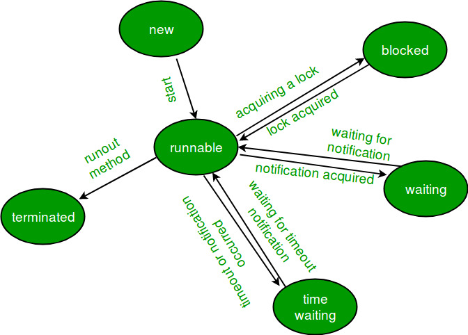

## Multithreading in Java

Multithreading is a Java feature that allows concurrent execution of two or more parts of a program for maximum utilization of CPU. Each part of such program is called a thread. So, threads are light-weight, independent path of execution within a program. Threads allow concurrent execution, enabling multiple tasks to be performed simultaneously.

## Lifecycle and States of a Thread in Java

The life cycle of a thread in Java consists of several stages, and understanding these stages is crucial for effective thread management.
Understanding the life cycle of a thread in Java allows developers to write efficient and robust multithreaded applications. By properly managing threads and their transitions between stages, you can ensure smooth execution and avoid issues like deadlocks or resource contention.



Let's explore each stage in detail with an example.

1. New: In the new stage, a thread is created but not yet started. The thread is in this stage when the `Thread` object is instantiated using the `new` keyword or by extending the `Thread` class. For example:

```java
Thread myThread = new Thread();
```

2. Runnable: In the runnable stage, the thread is ready to run but not currently executing. The thread can be in this stage after calling the `start()` method on the `Thread` object. For example:

```java
myThread.start();
```

3. Running: In the running stage, the thread is actively executing its code. It moves from the runnable stage to the running stage when the scheduler selects it for execution. The code within the `run()` method of the `Thread` class or a class implementing the `Runnable` interface is executed in this stage.

```java
public class MyThread implements Runnable {
    public void run() {
        // Thread code here
    }
}
```

4. Blocked: A thread enters the blocked stage when it is temporarily unable to run. This can occur if the thread is waiting for a resource, such as a lock or input/output operation, to become available. Once the blocking condition is resolved, the thread moves back to the runnable stage.

```java
synchronized (someObject) {
    // Code that requires exclusive access to someObject
}
```

5. Waiting: Threads enter the waiting stage when they are waiting for another thread to perform a particular action. This can happen when a thread invokes the `wait()` method on an object or waits indefinitely for a notification from another thread.

```java
synchronized (someObject) {
    someObject.wait();
}
```

6. Timed Waiting: In the timed waiting stage, a thread waits for a specified period of time. This can occur when a thread calls methods like `sleep()` or `join()`, specifying a time duration for the thread to wait.

```java
try {
    Thread.sleep(1000); // Sleep for 1 second
} catch (InterruptedException e) {
    // Exception handling
}
```

7. Terminated: A thread enters the terminated stage when its `run()` method completes execution or when the thread is explicitly stopped by invoking the `stop()` method. Once a thread is terminated, it cannot be restarted.

```java
// Terminating a thread
myThread.stop();
```

It's important to note that thread scheduling and transitions between these stages are managed by the Java Virtual Machine (JVM) and the operating system. Developers have limited control over the scheduling, but they can influence it using methods like `yield()` and `interrupt()`.

**code snippet demonstrating the thread life cycle:**

```java
 public class MyThread implements Runnable {
    public void run() {
        System.out.println("Thread is running.");
        try {
            Thread.sleep(2000); // Simulating some work
        } catch (InterruptedException e) {
            e.printStackTrace();
        }
        System.out.println("Thread has completed execution.");
    }

    public static void main(String[] args) {
        Thread myThread = new Thread(new MyThread());

        System.out.println("Thread is in the new state.");

        myThread.start();

        System.out.println("Thread is in the runnable state.");

        try {
            Thread.sleep(1000); // Giving some time for the thread to start
        } catch (InterruptedException e) {
            e.printStackTrace();
        }

        System.out.println("Thread is in the running state.");

        try {
            Thread.sleep(3000); // Giving some time for the thread to complete its execution
        } catch (InterruptedException e) {
            e.printStackTrace();
        }

        System.out.println("Thread is in the terminated state.");
    }
}
```

Threads can be created by using two mechanisms :

1. Extending the Thread class
2. Implementing the Runnable Interface

## Extending the Thread class:

We create a class that extends the java.lang.Thread class. This class overrides the run() method available in the Thread class. A thread begins its life inside run() method. We create an object of our new class and call start() method to start the execution of a thread. Start() invokes the run() method on the Thread object.
For example:

```java
public class ThreadExample extends Thread {
    private int threadId;

    public ThreadExample(int id) {
        this.threadId = id;
    }

    @Override
    public void run() {
        System.out.println("Thread " + threadId + " is running.");
        try {
            // Simulate some work
            Thread.sleep(2000);
        } catch (InterruptedException e) {
            e.printStackTrace();
        }
        System.out.println("Thread " + threadId + " has finished.");
    }

    public static void main(String[] args) {
        System.out.println("Main thread started.");

        // Create and start two threads
        ThreadExample thread1 = new ThreadExample(1);
        ThreadExample thread2 = new ThreadExample(2);
        thread1.start();
        thread2.start();

        // Wait for the threads to finish
        try {
            thread1.join();
            thread2.join();
        } catch (InterruptedException e) {
            e.printStackTrace();
        }

        System.out.println("Main thread finished.");
    }
}
```

In this example, we create a subclass `ThreadExample` that extends the `Thread` class. The class has a constructor that takes an integer `id` to identify each thread. The `run()` method is overridden to define the task that the thread should perform.

Inside the `run()` method, we print a message indicating that the thread is running, simulate some work by calling `Thread.sleep()`, and then print a message indicating that the thread has finished.

In the `main()` method, we create two instances of `ThreadExample` and start them by calling the `start()` method. This causes each thread to execute its `run()` method in a separate thread of execution. We also use the `join()` method to wait for the threads to finish before the main thread continues execution.

## Implementing the Runnable Interface

We create a new class which implements java.lang.Runnable interface and override run() method. Then we instantiate a Thread object and call start() method on this object.

For example:

```java
public class RunnableExample implements Runnable {
    private int threadId;

    public RunnableExample(int id) {
        this.threadId = id;
    }

    @Override
    public void run() {
        System.out.println("Thread " + threadId + " is running.");
        try {
            // Simulate some work
            Thread.sleep(2000);
        } catch (InterruptedException e) {
            e.printStackTrace();
        }
        System.out.println("Thread " + threadId + " has finished.");
    }

    public static void main(String[] args) {
        System.out.println("Main thread started.");

        // Create runnable instances
        RunnableExample runnable1 = new RunnableExample(1);
        RunnableExample runnable2 = new RunnableExample(2);

        // Create threads and start them
        Thread thread1 = new Thread(runnable1);
        Thread thread2 = new Thread(runnable2);
        thread1.start();
        thread2.start();

        // Wait for the threads to finish
        try {
            thread1.join();
            thread2.join();
        } catch (InterruptedException e) {
            e.printStackTrace();
        }

        System.out.println("Main thread finished.");
    }
}
```

In this example, we create a class `RunnableExample` that implements the `Runnable` interface. The class has a constructor that takes an integer `id` to identify each thread. The `run()` method is implemented to define the task that the thread should perform.

Inside the `run()` method, we print a message indicating that the thread is running, simulate some work by calling `Thread.sleep()`, and then print a message indicating that the thread has finished.

In the `main()` method, we create two instances of `RunnableExample`. Then we create two `Thread` objects, passing the respective `Runnable` instances as parameters. Finally, we start the threads by calling `start()` method.

As before, the main thread waits for the two threads to finish using the `join()` method, and then prints its own completion message.

Using the `Runnable` interface allows for better flexibility as it separates the task from the thread itself. Multiple threads can share the same `Runnable` instance, which can be useful in certain scenarios.

## Differences between `Runnable` and `Thread`

The differences between using the `Runnable` interface and extending the `Thread` class in Java for creating threads:

|                         | `Runnable` Interface                                                                                                                                            | `Thread` Class                                                                                                   |
| ----------------------- | --------------------------------------------------------------------------------------------------------------------------------------------------------------- | ---------------------------------------------------------------------------------------------------------------- |
| Inheritance             | Does not require extending a specific class.                                                                                                                    | Requires extending the `Thread` class.                                                                           |
| Reusability             | Can be used to implement multiple interfaces.                                                                                                                   | Cannot be used if the class needs to extend another class.                                                       |
| Separation of Concerns  | Supports better separation of concerns by separating the task logic from thread management.                                                                     | Combines both the task logic and thread management in a single class.                                            |
| Code Structure          | The `run()` method containing task logic is implemented separately and passed to a `Thread` object.                                                             | The task logic is implemented directly within the `Thread` class by overriding the `run()` method.               |
| Object-Oriented Design  | Promotes composition over inheritance, as the class implementing `Runnable` can be used with any class that accepts a `Runnable` object.                        | Uses inheritance to create a new class that is a specialized version of the `Thread` class.                      |
| Resource Sharing        | Encourages better resource sharing and avoids resource contention, as multiple threads can share the same `Runnable` instance.                                  | Each `Thread` instance has its own separate resources.                                                           |
| Concurrency Control     | Provides a more flexible approach for concurrency control, as multiple `Runnable` objects can be executed by a pool of threads managed by an `ExecutorService`. | Provides less control over thread execution and management, as each `Thread` instance manages its own execution. |
| Thread Creation         | Requires passing the `Runnable` instance to a `Thread` object for thread creation.                                                                              | Thread creation is direct, as the `Thread` instance is already created.                                          |
| Extending Other Classes | Allows extending other classes or implementing other interfaces alongside `Runnable`.                                                                           | Limits the ability to extend other classes alongside `Thread`.                                                   |

Both approaches have their merits depending on the specific requirements of your application. However, in general, using the `Runnable` interface is more recommended due to its flexibility, better separation of concerns, and support for composition and resource sharing.

## Threads in Android Applications:

In Android, you can use threads to perform time-consuming tasks in the background and keep the main UI thread responsive. However, Android provides higher-level abstractions for managing concurrent operations, such as `AsyncTask`, `Handler`, and `ThreadExecutor`. These abstractions handle thread management and synchronization for you, making it easier to work with threads in an Android application.

Here's an example of using the `Thread` class directly in an Android Java application:

```java
public class MyActivity extends AppCompatActivity {

    private static final String TAG = "MyActivity";

    @Override
    protected void onCreate(Bundle savedInstanceState) {
        super.onCreate(savedInstanceState);
        setContentView(R.layout.activity_my);

        // Create a new thread
        //using lamda expression
        // Thread backgroundThread = new Thread(() -> {
        Thread backgroundThread = new Thread(new Runnable() {
            @Override
            public void run() {
                // Perform time-consuming task
                Log.d(TAG, "Background thread is running.");

                try {
                    // Simulate some work
                    Thread.sleep(2000);
                } catch (InterruptedException e) {
                    e.printStackTrace();
                }

                // Update UI on the main thread
                runOnUiThread(new Runnable() {
                    @Override
                    public void run() {
                        Log.d(TAG, "Background thread has finished.");
                        // Update UI elements or perform other operations
                    }
                });
            }
        });

        // Start the background thread
        backgroundThread.start();
    }
}
```

In this example, we create a new thread in the `onCreate()` method of an `Activity` class. Inside the thread's `run()` method, we perform a time-consuming task (simulated by the `Thread.sleep()` method) and then update the UI on the main thread using `runOnUiThread()`. This is necessary because UI updates must be performed on the main thread in Android.

By creating a new thread, we ensure that the time-consuming task runs in the background, keeping the main UI thread responsive. This prevents the UI from freezing or becoming unresponsive while the task is running.

It's important to note that starting threads directly in an Android application should be used with caution. Android provides higher-level abstractions like `AsyncTask`, `Handler`, and `ThreadExecutor`, which handle thread management and synchronization more efficiently. These abstractions simplify the process of working with threads and are often recommended for handling background tasks in an Android application.
